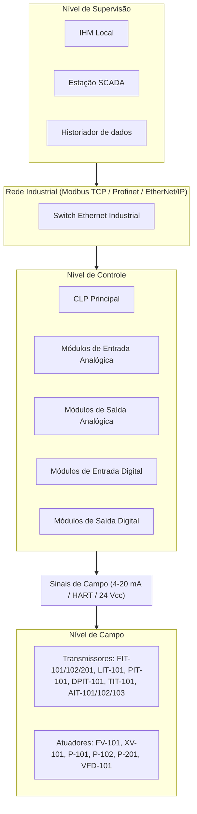

# Task 39: Atualizar documentação técnica com arquitetura de automação

## Overview

Atualizar a documentação técnica do projeto — prioritariamente o `README.md` ou o documento `docs/` relevante — para incluir uma seção completa de arquitetura de automação. A seção deve conter um diagrama textual ou Mermaid da hierarquia de camadas, a lista de equipamentos por camada, a explicação da comunicação entre camadas e a relação com o sistema web simulado. O objetivo é que esta seção atenda explicitamente ao requisito acadêmico #4 e sirva de apoio para a apresentação oral.

<critical>
- ALWAYS READ o `README.md` atual, o `_prd.md` e a `task_36.md` antes de começar
- REFERENCE `arquiteturaAutomacao.ts` (task_36) como fonte de verdade — não inventar equipamentos não listados lá
- FOCUS ON "WHAT" — adicionar a seção de arquitetura; não reescrever toda a documentação
- MINIMIZE CODE — apenas Markdown e diagrama Mermaid; sem modificar código fonte
- TESTS REQUIRED — verificar que o Markdown renderiza corretamente (GitHub/preview) e que o diagrama Mermaid é válido
</critical>

<requirements>
- MUST adicionar seção "Arquitetura de Automação" no `README.md` (ou no documento técnico principal do projeto)
- MUST incluir diagrama Mermaid `graph TD` representando a hierarquia de camadas
- MUST listar equipamentos mínimos por camada (campo, controle, supervisão, rede)
- MUST incluir parágrafo explicando a comunicação entre camadas
- MUST incluir tabela de equivalência entre sistema real e sistema simulado (os mesmos 6 pares de `arquiteturaAutomacao.ts`)
- MUST incluir o parágrafo modelo fornecido nos critérios de aceite da task
- MUST diferenciar claramente P&ID, sinóptico e arquitetura de automação no texto
- MUST NÃO remover ou sobrescrever seções existentes do README
- SHOULD posicionar a seção após a seção de P&ID e instrumentação, antes dos requisitos de execução
- SHOULD o texto estar preparado para ser lido em voz alta durante a apresentação oral
</requirements>

## Subtasks

- [x] 39.1 Ler `README.md` completo para identificar onde inserir a nova seção sem quebrar o fluxo
- [x] 39.2 Criar diagrama Mermaid `graph TD` com as camadas e equipamentos-chave
- [x] 39.3 Escrever parágrafo descritivo da arquitetura (usar o texto modelo como base)
- [x] 39.4 Escrever lista de equipamentos mínimos por camada
- [x] 39.5 Escrever explicação da comunicação entre camadas (sinais e protocolos)
- [x] 39.6 Adicionar tabela de equivalência sistema real × simulado
- [x] 39.7 Adicionar parágrafo diferenciando P&ID, sinóptico e arquitetura de automação
- [x] 39.8 Verificar renderização do Markdown e validade do diagrama Mermaid

## Implementation Details

Diagrama Mermaid sugerido:

Parágrafo modelo a incluir no README:

> A arquitetura de automação da planta é composta por instrumentos de campo responsáveis pela
> medição das variáveis do processo, atuadores responsáveis pela intervenção física na planta,
> um CLP central responsável pela lógica de controle e intertravamento, uma rede industrial de
> comunicação e um sistema supervisório para operação, alarmes e monitoramento em tempo real.

Parágrafo diferenciando documentos:

> **P&ID** (Piping and Instrumentation Diagram): representa o fluxo do processo, a tubulação e
> a instrumentação com suas conexões físicas. **Sinóptico**: representação gráfica simplificada
> do estado operacional em tempo real, usado pelo operador. **Arquitetura de automação**: define
> a hierarquia de equipamentos de controle, supervisão e comunicação que suportam a operação
> automatizada da planta.

### Relevant Files

- `README.md` — arquivo principal a atualizar
- `docs/` — verificar se existe documentação técnica adicional que também deva ser atualizada
- `frontend/src/dados/arquiteturaAutomacao.ts` — fonte de verdade para equipamentos e equivalências (task_36)

### Dependent Files

- `task_40.md` — roteiro de apresentação referenciará esta seção do README

### Related ADRs

- `_prd.md` — requisito acadêmico #4

## Deliverables

- Seção "Arquitetura de Automação" adicionada no `README.md` **(REQUIRED)**
- Diagrama Mermaid válido e renderizável **(REQUIRED)**
- Lista de equipamentos por camada **(REQUIRED)**
- Tabela de equivalência sistema real × simulado **(REQUIRED)**
- Parágrafo diferenciando P&ID, sinóptico e arquitetura **(REQUIRED)**
- Seções existentes do README intactas **(REQUIRED)**

## Tests

- Markdown:
  - [x] Diagrama Mermaid renderiza sem erros no GitHub ou em preview local
  - [x] Tabela Markdown de equivalência exibe 6 linhas de dados
  - [x] Nenhuma seção existente do README foi removida ou truncada
- Conteúdo:
  - [x] Seção contém os 4 equipamentos de supervisão (IHM, SCADA, historiador, painel de alarmes)
  - [x] Seção menciona pelo menos 5 instrumentos de campo pelo nome/tag
  - [x] Parágrafo diferenciando P&ID, sinóptico e arquitetura está presente

## Success Criteria

- A documentação diferencia claramente P&ID, sinóptico e arquitetura de automação
- A seção atende explicitamente ao requisito acadêmico #4
- O texto está pronto para ser lido durante a apresentação oral sem adaptações
- A documentação continua coerente com o restante do projeto
