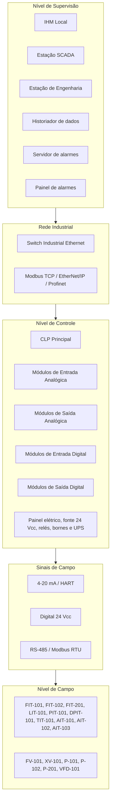

# Automação Industrial: Simulador Web de Tratamento de Água

## Visão geral do projeto

Este projeto é um simulador web acadêmico de uma planta industrial de
tratamento de água. Ele demonstra instrumentação, variáveis de processo,
atuadores, alarmes, intertravamentos e uma Matriz de Causa e Efeito em uma
interface supervisória simplificada.

O backend Python com FastAPI simula a dinâmica da planta, a lógica de controle
e os efeitos da matriz. O frontend React com TypeScript representa a camada de
supervisão, exibindo sinóptico, variáveis, atuadores, alarmes e cenários de
demonstração.

Em uma arquitetura industrial real, a lógica de controle estaria em um CLP e a
operação seria feita por IHM/SCADA. Neste projeto acadêmico, o backend Python
representa conceitualmente o CLP e a dinâmica simulada da planta, enquanto o
frontend React representa uma tela supervisória didática.

## Arquitetura de Automação

Esta seção atende explicitamente ao requisito acadêmico #4: elaborar uma
arquitetura de automação com especificação mínima dos equipamentos necessários.
A arquitetura de automação da planta é composta por instrumentos de campo
responsáveis pela medição das variáveis do processo, atuadores responsáveis
pela intervenção física na planta, um CLP central responsável pela lógica de
controle e intertravamento, uma rede industrial de comunicação e um sistema
supervisório para operação, alarmes e monitoramento em tempo real.



### Equipamentos por camada

| Camada | Equipamentos mínimos |
|---|---|
| Campo | Transmissores e analisadores `FIT-101`, `FIT-102`, `LIT-101`, `PIT-101`, `DPIT-101`, `TIT-101`, `AIT-101`, `AIT-102`, `AIT-103` e `FIT-201`; atuadores `FV-101`, `XV-101`, `P-101`, `P-102`, `P-201` e `VFD-101`. |
| Controle | `CLP Principal`, módulos `AI`, `AO`, `DI` e `DO`, fonte de alimentação 24 Vcc, relés de interface, disjuntores e seccionadoras, bornes de passagem, painel elétrico de controle e nobreak/UPS. |
| Supervisão | `IHM Local`, `Estação SCADA`, `Estação de Engenharia`, `Historiador de dados`, `Servidor de alarmes` e `Painel de alarmes`. |
| Rede | `Switch Industrial Ethernet`, comunicação CLP e SCADA por `Modbus TCP`, `EtherNet/IP` ou `Profinet`, sinais de instrumentação `4-20 mA / HART`, sinais discretos `24 Vcc` e comunicação com inversor por `RS-485 / Modbus RTU`. |

### Comunicação entre camadas

No nível de campo, os transmissores enviam medições analógicas de vazão, nível,
pressão, temperatura e qualidade da água para os módulos de entrada do CLP por
sinais `4-20 mA / HART`. Os atuadores recebem comandos do CLP por saídas
analógicas, sinais digitais `24 Vcc` ou comunicação serial com o inversor
`VFD-101`. No nível de controle, o CLP executa a lógica de intertravamento e a
Matriz de Causa e Efeito, comandando bombas, válvulas e alarmes. No nível de
supervisão, IHM, SCADA, historiador e painel de alarmes trocam dados com o CLP
pela rede industrial, permitindo operação, monitoramento, registro histórico e
tratamento de eventos.

No sistema web simulado, essa separação é mantida de forma didática. O backend
Python representa o estado de processo, a lógica de controle e a Matriz de
Causa e Efeito que existiriam no CLP. O frontend React representa a IHM/SCADA,
com sinóptico, cards de variáveis, atuadores e alarmes. A API HTTP entre
frontend e backend representa, para fins acadêmicos, a troca de dados que em
uma planta real ocorreria por uma rede industrial.

### Equivalência entre sistema real e sistema simulado

| Sistema real | Sistema simulado |
|---|---|
| Instrumentos de campo | Estado de processo calculado pelo backend Python |
| CLP | Controlador em Python no backend |
| Matriz de intertravamento | Matriz de Causa e Efeito implementada em Python |
| Bombas e válvulas | Ações de controle aplicadas ao modelo da planta |
| IHM local / Sistema SCADA | Frontend React com sinóptico, cards e alarmes |
| Rede industrial | Comunicação HTTP entre frontend e backend via API REST |

### Diferença entre P&ID, sinóptico e arquitetura

**P&ID** (Piping and Instrumentation Diagram): representa o fluxo do processo,
a tubulação e a instrumentação com suas conexões físicas. **Sinóptico**:
representação gráfica simplificada do estado operacional em tempo real, usado
pelo operador. **Arquitetura de automação**: define a hierarquia de
equipamentos de controle, supervisão e comunicação que suportam a operação
automatizada da planta.

## Como executar localmente com `.venv`

Use a `.venv` existente na raiz do projeto. Não é necessário criar outro
ambiente virtual.

Instale o backend em modo desenvolvimento:

```bash
source .venv/bin/activate && pip install -e backend/[dev]
```

Execute o backend:

```bash
source .venv/bin/activate
PYTHONPATH=backend/src uvicorn \
  automacao_industrial.aplicacao.fabrica_aplicacao:criar_aplicacao \
  --factory --reload --host 127.0.0.1 --port 8000
```

Instale e execute o frontend:

```bash
cd frontend
npm install
npm run dev
```

Com os dois serviços ativos, acesse o frontend em `http://localhost:5173`.
A API do backend fica disponível em `http://localhost:8000/api`.

## Como executar via Docker Compose

Execute o sistema completo, com backend e frontend, a partir da raiz do
projeto:

```bash
docker compose up --build
```

O frontend de produção é servido pelo nginx na porta `80` e encaminha chamadas
`/api/*` para o serviço `backend` na porta `8000` dentro da rede Docker.

Para parar os serviços:

```bash
docker compose down
```

## Como depurar no VS Code

As configurações de debug ficam em `.vscode/`.

Para depurar o backend:

1. Abra o projeto no VS Code.
2. Selecione a configuração `Backend Python`.
3. Inicie o debug. O VS Code usa `${workspaceFolder}/.venv/bin/python`.
4. Defina breakpoints no backend, por exemplo na Matriz de Causa e Efeito.

Para depurar o frontend:

1. Selecione a configuração `Frontend React`.
2. O VS Code executa a tarefa `Rodar frontend (dev)`.
3. O navegador abre `http://localhost:5173` com sourcemaps habilitados.
4. Defina breakpoints nos componentes TypeScript/React.

Também existem tarefas para instalar dependências, rodar backend, rodar testes
do backend, subir Docker Compose e derrubar Docker Compose.

## Estrutura do projeto

```text
.
├── backend/                  # API FastAPI, domínio, controle e simulação
│   ├── src/automacao_industrial/
│   └── tests/
├── frontend/                 # Interface supervisória React + TypeScript
│   └── src/
├── docs/                     # Documentação técnica e acadêmica
├── .vscode/                  # Debug e tarefas do VS Code
├── .compozy/                 # Artefatos do workflow Compozy
├── .specs/                   # Especificação principal do projeto
├── docker-compose.yml        # Execução completa em produção
└── docker-compose.dev.yml    # Execução em desenvolvimento
```

Documentos técnicos principais:

- `docs/pid-conceitual.md`: P&ID conceitual da planta.
- `docs/lista-instrumentos.md`: lista completa dos instrumentos.
- `docs/folha-dados-fit101.md`: folha de dados do FIT-101.
- `docs/arquitetura-automacao.md`: arquitetura em níveis de automação.
