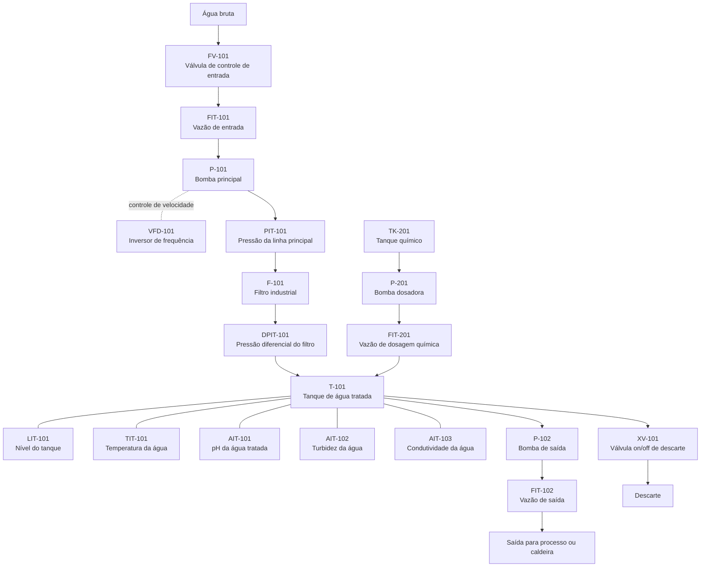

# P&ID Conceitual

Este P&ID conceitual representa a planta simplificada de tratamento de água
industrial usada no simulador acadêmico. O foco é identificar os equipamentos,
instrumentos e atuadores por tag industrial.

## Diagrama conceitual

## Sequência de processo

| Etapa | Elemento | Descrição |
|---|---|---|
| 1 | Água bruta | Entrada de água na planta |
| 2 | FV-101 | Controle da entrada de água bruta |
| 3 | FIT-101 | Medição da vazão de entrada |
| 4 | P-101 / VFD-101 | Bombeamento principal com controle de velocidade |
| 5 | PIT-101 | Medição da pressão da linha principal |
| 6 | F-101 / DPIT-101 | Filtração e medição de saturação do filtro |
| 7 | T-101 | Armazenamento de água tratada |
| 8 | LIT-101 | Medição de nível do tanque |
| 9 | TIT-101 | Medição de temperatura |
| 10 | AIT-101 | Análise de pH |
| 11 | AIT-102 | Análise de turbidez |
| 12 | AIT-103 | Análise de condutividade |
| 13 | TK-201 / P-201 / FIT-201 | Dosagem química antes do tanque |
| 14 | P-102 / FIT-102 | Envio de água tratada ao processo |
| 15 | XV-101 | Descarte de água fora de especificação |

## Tags identificadas

`FIT-101`, `FIT-102`, `LIT-101`, `PIT-101`, `DPIT-101`, `TIT-101`,
`AIT-101`, `AIT-102`, `AIT-103`, `FIT-201`, `FV-101`, `XV-101`, `P-101`,
`P-102`, `P-201` e `VFD-101`.
